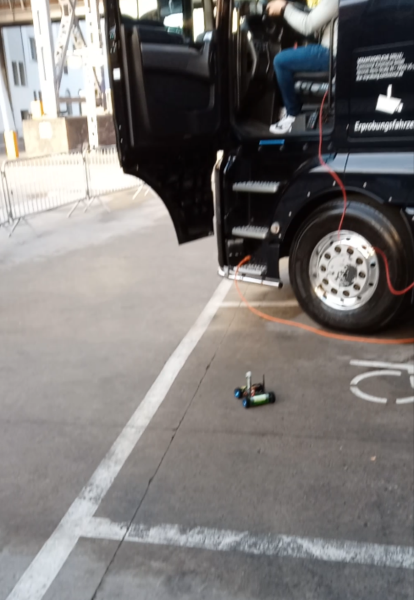

# JetRacer Remote Control 

## Installation

- install necessary dependencies (eCal: Resources)
- unzip the content of your measurement.zip into the root directory

```bash
unzip measurement.zip
```

- activate virtual env
```python
source ./venv/bin/activate
```

## Usage

- run test with
```python
python hello_world_python.py
```

- to run a measurement
```bash
./play.sh
```

- or simply run the program with
```bash
./run.sh
```

## Images

JetRacer in action
<br>


JetRacer up-close
<br>


## Resources

- https://github.com/Eclipse-SDV-Hackathon-BCX/hackchallenge-hack-the-truck
- https://github.com/Eclipse-SDV-Hackathon-BCX
- https://github.com/eclipse-ecal/ecal
- https://eclipse-ecal.github.io/ecal/getting_started/hello_world_python.html
- https://github.com/Eclipse-SDV-Hackathon-BCX/.github/blob/main/profile/JetRacer.md
